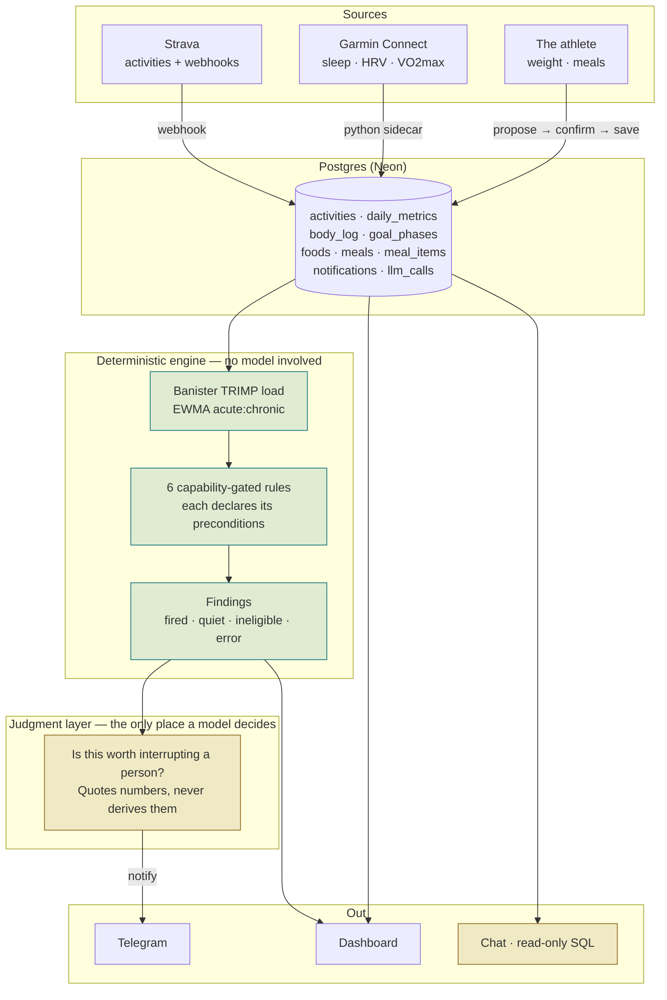

# RunNudge

A proactive training-insights system over my own Strava + Garmin running data. It reacts to runs as they happen — ingesting, analyzing, and notifying — rather than waiting to be asked.

See [docs/PLAN.md](docs/PLAN.md) for the full plan and rationale.

## Status

**Day 7 — nutrition + body composition.** Strava ingestion (Day 1), Garmin metrics via a Python sidecar (Day 2), a deterministic insight engine with capability-gated rules (Day 3), and a webhook-driven pipeline where Claude judges whether findings warrant a notification (Day 4). Notifications arrive on Telegram with a weekly digest on cron (Day 5), and a dashboard plus AI SDK chat layer answer questions from live SQL (Day 6). Meals are logged conversationally — photo or text — through a propose-confirm-save flow where the model never states a total and never writes a row; weight and goal phases are dated state, and no trend is ever fitted across a phase boundary (Day 7).


## Architecture



**The load-bearing division is horizontal, not vertical.** Everything numeric is
computed in SQL or in the engine. The model gets a finished report and does two
jobs: decide whether it is worth interrupting someone, and write the sentence.
It never derives a figure, and it is handed the *ineligible* findings too — so
it cannot phrase missing data as reassurance.

## Why the chat can't do this on its own

The obvious build is "point an LLM at the database and ask it questions." That
version cannot produce the thing this system is for, and the reasons are worth
being precise about.

**Chat is reactive; the product is not.** The whole point is the message that
arrives *without being asked*, on a Tuesday, because a ratio moved. Nobody opens
a chat window to ask whether anything is wrong — you ask when you already
suspect it. A system that only answers questions can never tell you the thing
you did not think to ask.

**"Nothing to report" and "nothing recorded" are different sentences.** This
athlete's watch data is intermittent by design — 11 nights of sleep in May and
June, nothing since. Asked "how's my recovery", a model over a database returns
*no rows* and reports reassurance. The engine instead declares what each rule
needs before it runs, so an unmeasured week comes back `ineligible` with its
unlock condition attached, and the dashboard draws the hole rather than omitting
it. That distinction is a schema and a set of preconditions, not a prompt.

**The same question must give the same answer twice.** An ACWR is a decision
input; a number that drifts because it was re-derived by a language model is
worse than no number. Load, ratios, meal calories and weight trends are computed
deterministically and stored, so the dashboard, the notification and the chat
answer all quote one figure. Day 7 measured this directly: asked twice about the
same dish, the model's *own* estimate of its composition drifted (carbs 18 → 19,
fat 6 → 5.5) while the stored row held the total steady.

**Someone has to decide not to speak.** Most days, correctly, nothing is worth
sending. That judgment — significance, not calculation — is the one thing here a
model does better than a threshold, and it is exactly one call in the pipeline.
Every withheld notification is stored with its reasoning, so the decision to stay
quiet is auditable rather than invisible.

Chat is the fourth surface, not the product. It exists so you can interrogate a
shape you noticed on the dashboard, and it answers with the SQL shown.

## Stack

- Next.js (App Router) + TypeScript
- Vercel AI SDK + AI Elements for the chat layer; Anthropic API for the judgment layer
- Neon Postgres + Drizzle ORM
- Strava REST API v3 (OAuth 2 + webhooks)
- Meal totals computed in SQL from stored per-100g composition — never stored, never stated by the model
- Python sidecar for Garmin Connect (unofficial API) — isolated; the app never imports it

## Setup

### 1. Environment

```bash
cp .env.example .env
openssl rand -hex 24   # paste as ADMIN_TOKEN
```

Fill in `DATABASE_URL` from Neon (use the **pooled** connection string — its host contains `-pooler`).

### 2. Create a Strava API application

At <https://www.strava.com/settings/api>:

- **Authorization Callback Domain:** `localhost` for local development
- Copy the Client ID and Client Secret into `.env`

The OAuth redirect URI is derived as `$APP_URL/api/strava/callback` — nothing to configure beyond the callback domain.

### 3. Migrate

```bash
npm run db:migrate
```

### 4. Connect Strava

```bash
npm run dev
```

Then visit `http://localhost:3000/api/strava/authorize?token=<ADMIN_TOKEN>` and accept **all** permissions. The callback rejects a partial grant: without `activity:read_all` the backfill silently skips private activities.

### 5. Backfill

```bash
npm run backfill                    # full history, resumable
npm run backfill -- --since 2024-01-01
npm run backfill -- --restart       # ignore the checkpoint
```

Progress is checkpointed to `sync_state` after every page, so a rate limit or a crash costs one page rather than the whole run. Strava's default quota is 200 requests per 15 minutes; the client reads the quota headers, warns near the ceiling, and waits out a 429 instead of failing.

### 6. Garmin (optional)

Garmin has no official consumer API, so this uses the community `garminconnect`
library from an isolated Python sidecar. The Next.js app never imports it — the
two sides meet only at the `daily_metrics` table.

```bash
python3 -m venv .venv
.venv/bin/pip install -r requirements.txt
```

Add your Garmin Connect login to `.env` (`GARMIN_EMAIL`, `GARMIN_PASSWORD`),
then:

```bash
.venv/bin/python scripts/garmin_sync.py --days 7
.venv/bin/python scripts/garmin_sync.py --since 2026-05-17
.venv/bin/python scripts/garmin_sync.py --date 2026-07-26
```

If the account has MFA, run it from a real terminal the first time so the code
prompt can be answered. Tokens are then cached in `.garmin-tokens/` (gitignored)
and later runs are unattended — which matters, because repeated password logins
are what gets a Garmin account rate-limited.

## Scripts

| Command                                     | Purpose                                      |
| ------------------------------------------- | -------------------------------------------- |
| `npm run dev`                               | Next.js dev server                           |
| `npm run db:generate`                       | Generate a migration from `src/db/schema.ts` |
| `npm run db:migrate`                        | Apply pending migrations                     |
| `npm run db:studio`                         | Drizzle Studio — browse the data             |
| `npm run backfill`                          | Pull Strava history into the DB              |
| `npm run typecheck`                         | `tsc --noEmit`                               |
| `npm test`                                  | Invariant tests for the analysis engine      |
| `npm run analyze`                           | Replay the engine over your whole history    |
| `npm run analyze -- --validate`             | Cross-check our load ratio against Garmin's  |
| `npm run sensitivity`                       | Sweep every threshold: plateau, cliff, inert |
| `npm run simulate`                          | Push curated events through the full pipeline |
| `npm run webhook -- view\|create\|delete`    | Manage the Strava webhook subscription       |
| `npm run notify -- chat-id\|test\|pending`   | Telegram setup and delivery                  |
| `npm run notify -- digest [--dry]`          | Build (and send) this week's digest          |
| `.venv/bin/python scripts/garmin_sync.py`   | Pull Garmin daily metrics into the DB        |
| `npm run eval`                              | Honesty regression set — 10 chat cases       |
| `npm run eval -- https://app.example.com`   | The same set against a deployment            |
| `npm run cost`                              | Recorded model spend vs the all-Opus default |

> `db:generate` prompts interactively when it can't tell a column rename from a
> drop-and-add, so it needs a real terminal — it will crash under a piped shell.

## Layout

```
src/
  app/api/strava/
    authorize/      OAuth entrypoint (gated by ADMIN_TOKEN)
    callback/       code exchange + scope validation
  db/
    schema.ts       activities, strava_tokens, sync_state
    client.ts       Drizzle over postgres.js
  lib/
    env.ts          lazily validated environment
    strava/
      oauth.ts      token exchange, refresh, persistence
      client.ts     API client with rate-limit handling
      normalize.ts  SummaryActivity -> activities row
      types.ts      zod schemas for Strava payloads
    ingest/
      activities.ts idempotent upsert + sync checkpoints
scripts/
  backfill.ts       resumable history backfill
drizzle/            generated SQL migrations
```

## Design notes

**Tokens are read in exactly one place.** `getAccessToken()` refreshes and persists before returning, so no caller can use a stale token. Strava rotates the refresh token on refresh, so whatever comes back is always what gets stored.

**Every activity keeps its raw payload.** Normalized columns carry what the analysis engine needs; `activities.raw` keeps the untouched JSON, so adding a column later is a migration rather than a re-backfill.

**Ingestion is idempotent.** The backfill and (later) webhook delivery share one upsert keyed on Strava's activity id — a duplicate webhook or a re-run backfill can't create a second row, and a renamed activity overwrites cleanly.

**Local time is stored separately.** Strava's `start_date_local` is an ISO string with a misleading `Z`; the digits are wall-clock. It lands in a `timestamp without time zone` so "a Tuesday morning run" survives travel and server timezones.
